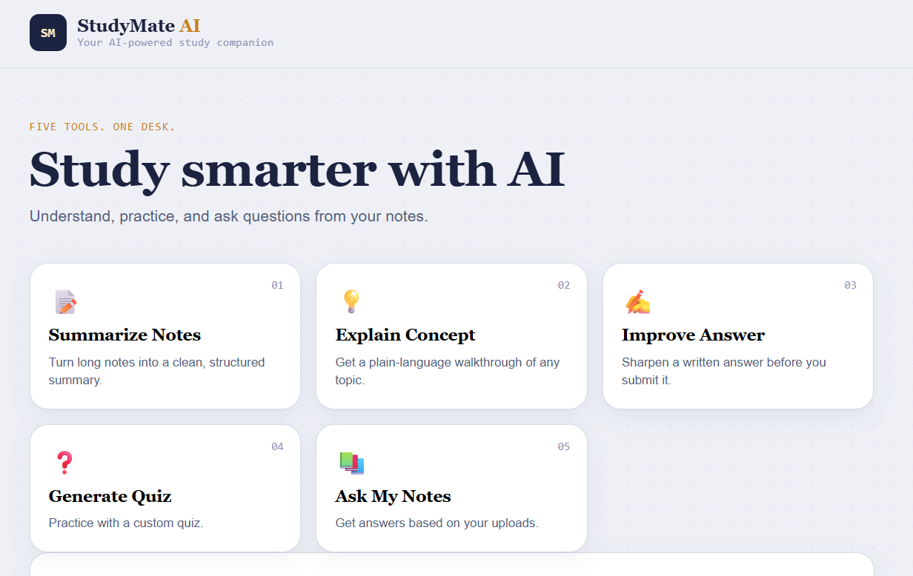
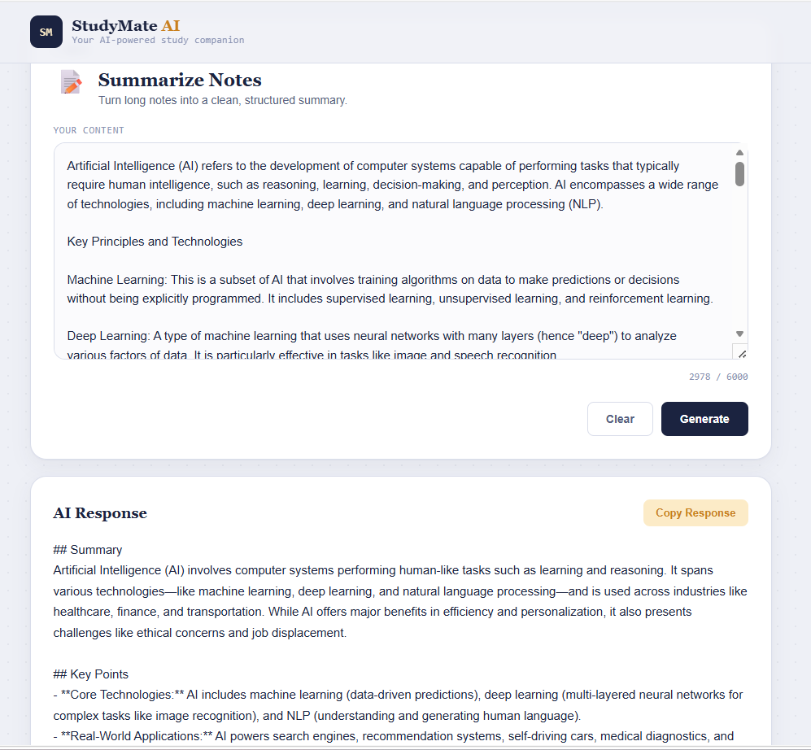
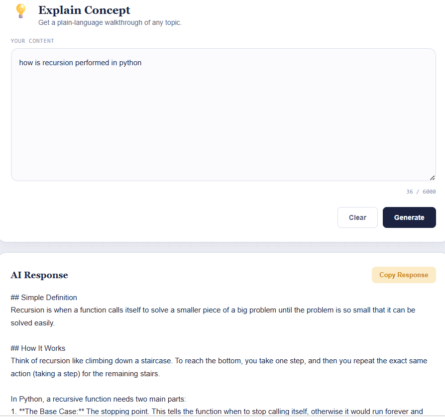
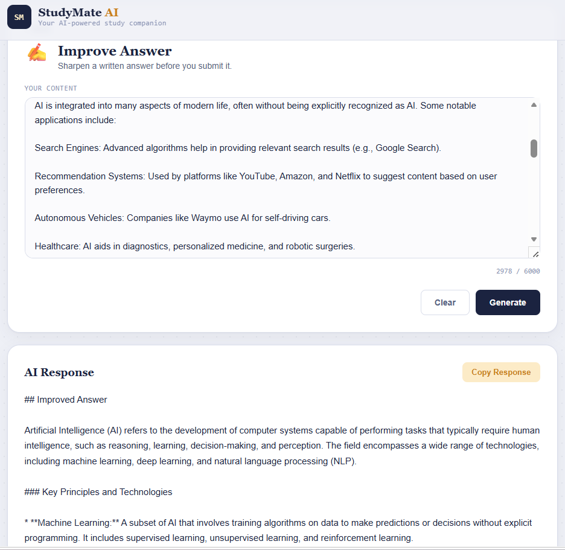
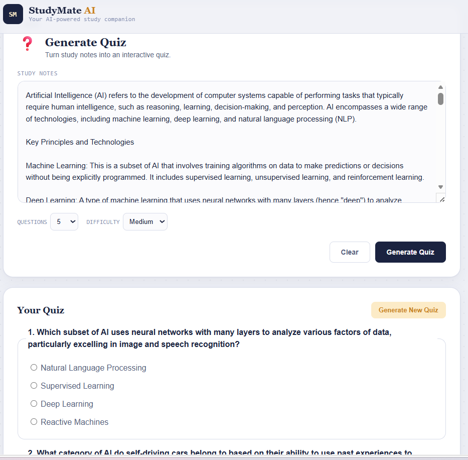
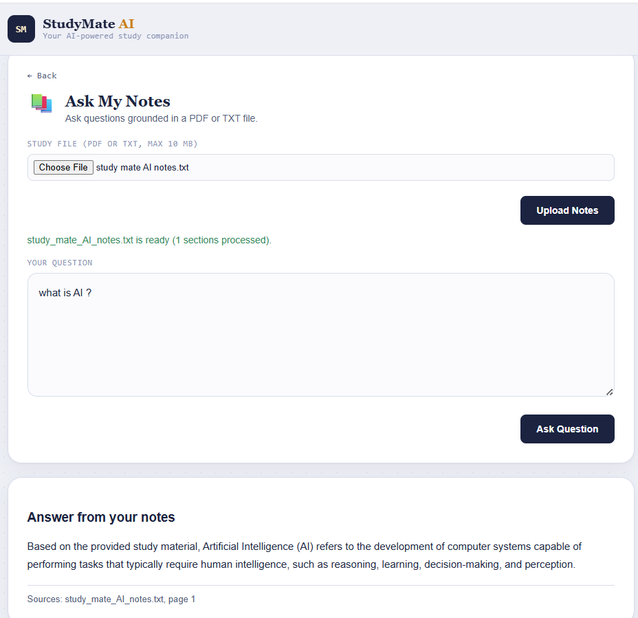

# 📚 StudyMate AI

### AI-Powered Study Companion with Quiz Generation & RAG

<div align="center">

**Understand • Practice • Improve • Ask Questions**


</div>

---

## 📌 Overview

**StudyMate AI** is a full-stack, AI-powered study companion designed to help students **understand, summarize, improve, practice, and interact with their study material** from a single web application.

The application combines **Google Gemini, prompt engineering, quiz generation, embeddings, semantic search, and Retrieval-Augmented Generation (RAG)** to provide five focused study utilities.

### StudyMate AI provides:

1. 📝 **Summarize Notes**
2. 💡 **Explain Concept**
3. ✍️ **Improve Answer**
4. 🧠 **Generate Quiz**
5. 📖 **Ask My Notes — RAG**

The project uses a beginner-friendly architecture built with **Flask and vanilla JavaScript**, without a traditional database, authentication system, or heavy AI framework.

---

# 🎯 Problem Statement

Students often face several challenges while preparing for exams, assignments, and interviews:

- Long lecture notes are difficult to review quickly.
- Technical concepts can be difficult to understand.
- Students may not know how to improve their written answers.
- Creating practice questions manually takes time.
- Finding specific information inside large study documents can be difficult.

StudyMate AI combines these workflows into one simple platform.

```text
Understand → Summarize → Improve → Practice → Ask

---

# 🎯 Objectives

The main objectives of StudyMate AI are to:

- Build a practical AI-powered study application for students.
- Provide multiple AI-assisted study utilities in one platform.
- Use prompt engineering to generate structured and useful responses.
- Generate interactive quizzes from study material.
- Implement a Retrieval-Augmented Generation (RAG) system.
- Ground AI answers in the user's uploaded study material.
- Use embeddings and vector similarity search for document retrieval.
- Keep API credentials secure on the backend.
- Implement validation on both frontend and backend.
- Handle AI, network, and file-processing errors gracefully.
- Maintain a simple and modular architecture that is easy to understand and extend.

---

# 🚀 Features

StudyMate AI provides **five AI-powered study modules**, each designed to solve a different problem faced by students during learning, exam preparation, and interview preparation.

---

## 📝 1. Summarize Notes

The **Summarize Notes** module helps students quickly understand lengthy study material.

Students can paste lecture notes, textbook content, or other study material, and StudyMate AI converts it into a shorter and easier-to-review format.

### Key Features

- Generates a concise summary of long notes
- Highlights important points
- Identifies important terms
- Organizes information in an easy-to-read format
- Helps students revise large topics quickly

This module is especially useful during **exam revision**, when students need to review large amounts of content in a short period of time.

---

## 💡 2. Explain Concept

The **Explain Concept** module helps students understand difficult academic and technical concepts in simple language.

Students can enter any concept or topic they are struggling with, and the AI provides a structured explanation.

### Key Features

- Provides a simple definition
- Explains how the concept works
- Gives real-world examples
- Provides simple examples for better understanding
- Highlights the main takeaway

This module acts like an **AI tutor**, making complex concepts easier for students to understand.

---

## ✍️ 3. Improve Answer

The **Improve Answer** module helps students improve answers written for exams, assignments, or interviews.

Students can paste their existing answer, and StudyMate AI analyzes it and generates a clearer and stronger version.

### Key Features

- Improves the structure of the answer
- Makes the explanation clearer
- Identifies weak areas
- Provides suggestions for improvement
- Generates an improved version of the answer

This module helps students understand **how they can present their knowledge more effectively**.

---

## 🧠 4. Generate Quiz

The **Generate Quiz** module allows students to convert their study material into an interactive multiple-choice quiz.

Students paste their notes, select the number of questions and difficulty level, and StudyMate AI automatically generates a quiz.

### Key Features

- Generates quizzes directly from study notes
- Supports **5, 10, or 15 questions**
- Supports **Easy, Medium, and Hard** difficulty levels
- Provides four options for every question
- Allows students to select answers interactively
- Calculates the final score
- Displays correct and incorrect answers
- Provides explanations for answers

This module allows students to move from **passive reading to active learning** by testing their understanding of a topic.

---

## 📖 5. Ask My Notes — RAG

The **Ask My Notes** module allows students to upload their own study material and ask questions specifically based on that document.

It uses **Retrieval-Augmented Generation (RAG)** to find relevant information from the uploaded notes before generating an answer.

### Supported Documents

- PDF
- TXT

### Key Features

- Upload personal study material
- Ask questions about the uploaded document
- Retrieves relevant information from the notes
- Generates answers based on the uploaded material
- Displays the source filename
- Displays page information when available
- Reduces answers based purely on unrelated general AI knowledge

### Simple RAG Flow

```text
Upload Study Material
        ↓
Process Document
        ↓
Find Relevant Information
        ↓
Send Relevant Context to Gemini
        ↓
Generate Answer
        ↓
Display Answer + Source

---

---

# 📸 Screenshots

## 🏠 Home Page

The home page provides access to all five StudyMate AI modules from a single interface.



---

## 📝 Summarize Notes

Students can enter their study material and generate a concise summary with important information.



---

## 💡 Explain Concept

Students can enter a difficult concept and receive a simple explanation with examples.



---

## ✍️ Improve Answer

Students can enter an existing answer and receive an improved and clearer version.



---

## 🧠 Generate Quiz

Students can generate interactive MCQ quizzes by selecting the number of questions and difficulty level.



---

## 📖 Ask My Notes — RAG

Students can upload PDF or TXT study material and ask questions based on the uploaded document.



---

# 🛠️ Technology Stack

| Technology | Purpose |
|---|---|
| **Python 3.11** | Backend development and AI integration |
| **Flask** | Web application backend and API handling |
| **HTML5** | Structure of the web interface |
| **CSS3** | Styling and responsive user interface |
| **Vanilla JavaScript** | Frontend interactions and API communication |
| **Google Gemini** | AI-powered summarization, explanations, answer improvement, quizzes, and RAG responses |
| **Gemini Embeddings** | Converts document content into numerical representations for semantic search |
| **FAISS** | Stores and searches document embeddings efficiently |
| **PyMuPDF** | Extracts text and page information from PDF documents |
| **python-dotenv** | Loads environment variables such as the Gemini API key |

---

# 🏗️ Project Architecture

StudyMate AI follows a simple **frontend–backend architecture**.

```text
                    ┌──────────────────────┐
                    │      User / Student  │
                    └──────────┬───────────┘
                               │
                               ▼
                    ┌──────────────────────┐
                    │   HTML / CSS / JS    │
                    │      Frontend        │
                    └──────────┬───────────┘
                               │
                         API Requests
                               │
                               ▼
                    ┌──────────────────────┐
                    │       Flask          │
                    │       Backend        │
                    └──────────┬───────────┘
                               │
                 ┌─────────────┴─────────────┐
                 │                           │
                 ▼                           ▼
        ┌─────────────────┐         ┌─────────────────┐
        │  Gemini AI      │         │   RAG System    │
        │                 │         │                 │
        │ • Summarize     │         │ • PDF/TXT       │
        │ • Explain       │         │ • Embeddings    │
        │ • Improve       │         │ • FAISS Search  │
        │ • Generate Quiz │         │ • Context       │
        └─────────────────┘         └────────┬────────┘
                                             │
                                             ▼
                                      ┌───────────────┐
                                      │ Gemini AI     │
                                      │ Grounded      │
                                      │ Response      │
                                      └───────────────┘

---

# 🔗 API Endpoints

StudyMate AI uses Flask API endpoints to connect the frontend with the backend AI services.

| Method | Endpoint | Purpose |
|---|---|---|
| `POST` | `/api/generate` | Handles summarization, concept explanation, and answer improvement |
| `POST` | `/api/quiz` | Generates AI-powered quizzes |
| `POST` | `/api/rag/upload` | Uploads and processes study documents |
| `POST` | `/api/rag/ask` | Answers questions using uploaded study material |

---

# 🤖 AI Integration

StudyMate AI uses **Google Gemini** as the primary AI model.

Gemini is used across multiple modules for:

- Summarizing study material
- Explaining concepts
- Improving written answers
- Generating quiz questions
- Generating answers from retrieved document content

The application uses different prompts depending on the selected module so that the AI response is focused on the student's specific requirement.

---

# 🧠 Retrieval-Augmented Generation (RAG)

The **Ask My Notes** module uses Retrieval-Augmented Generation to make the AI response more relevant to the student's uploaded material.

Instead of simply asking the AI a question, the system first looks for relevant information from the uploaded document and then uses that information to generate the response.

### RAG Process

```text
Student Uploads PDF / TXT
          ↓
    Document Processing
          ↓
   Text is Extracted
          ↓
     Text is Chunked
          ↓
     Create Embeddings
          ↓
      FAISS Search
          ↓
 Retrieve Relevant Content
          ↓
     Gemini Generates
          ↓
     Grounded Answer

# 📂 Project Structure
studymate-ai/
│
├── app.py
│
├── services/
│   ├── ai_service.py
│   ├── quiz_service.py
│   └── rag_service.py
│
├── rag/
│   ├── document_processor.py
│   ├── embeddings.py
│   └── vector_store.py
│
├── templates/
│   └── index.html
│
├── static/
│   ├── style.css
│   └── script.js
│
├── screenshots/
│   ├── home.png
│   ├── summarize.png
│   ├── explain.png
│   ├── improve.png
│   ├── quiz.png
│   └── rag.png
│
├── .env.example
├── .gitignore
├── requirements.txt
└── README.md


# 🔑 Environment Variables

StudyMate AI requires a Google Gemini API key

# ⚙️ Installation & Setup
1. Clone the Repository
git clone <your-github-repository-url>
cd studymate-ai
2. Create a Virtual Environment
python -m venv venv
3. Activate the Virtual Environment
Windows
venv\Scripts\activate
macOS / Linux
source venv/bin/activate
4. Install Dependencies
pip install -r requirements.txt
5. Create the .env File

Create a .env file in the project root and configure the required environment variables.

GEMINI_API_KEY=your_api_key_here
GEMINI_MODEL=gemini-2.5-flash
GEMINI_EMBEDDING_MODEL=gemini-embedding-001
MAX_UPLOAD_SIZE_MB=10

6. Run the Application
python app.py

Open the application in your browser:

http://127.0.0.1:5000

# 🔮 Future Improvements

Possible future enhancements include:

👤 User authentication and personalized profiles
💾 Persistent storage for uploaded documents
📚 Multiple document support
💬 Conversation history

# 👨‍💻 Author

Mohammed Shazin Afras

StudyMate AI — AI-Powered Study Companion

Built to explore the practical application of:

Generative AI • RAG • Embeddings • Semantic Search • Full-Stack Development
